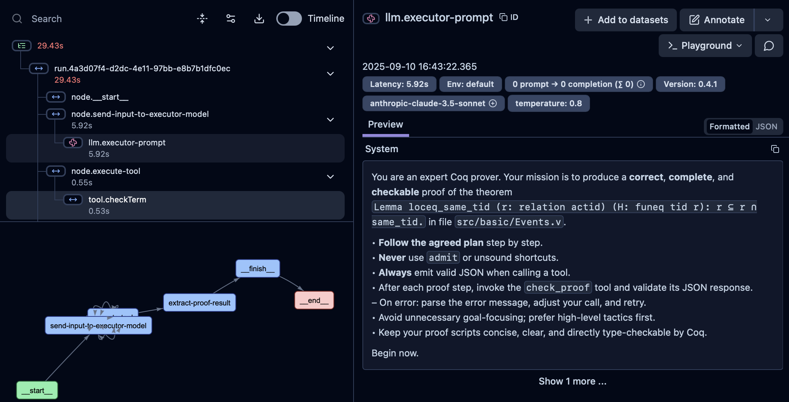

# RocqStar agent 

The first version of the agent was written using a private framework called IDEFormer. We have afterward rewritten it into the new [Koog](https://docs.koog.ai) framework by JetBrains. Koog is a Kotlin-based framework designed to build and run AI agents entirely in idiomatic Kotlin.

On the top-level, the agent communicates to the Rocq-MCP server and Rocq Project server and generates the proofs for theorems. A detailed guide on running the MCP server might be found in [its repo](https://github.com/JetBrains-Research/rocqstar-agentic-system), but here is a short summary of the required steps, before running the agent:
1. Choose a project you want to run your agent on. The project might be built with Opam or Nix. Both should work. **_tl;dr_** your goal now is to run the MCP server so that it correctly resolves the path to the coq-LSP server. If you are using Nix, you need to activate the shell using `nix-shell`, build the project using `make`, and then run the Rocq-MCP server in that shell. If you have completed the steps from the [Rocq-MCP repo](https://github.com/JetBrains-Research/rocqstar-agentic-system), you should be able to run `coqpilot-server`.     
2. If you are using the RocqStar-retrieval mechanism (which is used in the Rocq-mcp) by default, you should complete the steps in the readme of the [RocqStar retriever repo](https://github.com/JetBrains-Research/rocqstar-rag), specifically, run the ranker server, described [here](https://github.com/JetBrains-Research/rocqstar-rag/blob/main/ranker-server/README.md). 
3. After you run all the components, simply build this project using gradle and run `Main.kt`. 

## Agent running details

Parameters of the run are configured in the `agent-config.yaml`, it has a list of properties to define the desired behavior. API keys and secrets are loaded from `.env` file. All API keys are optional and are resolved to non-optionals upon use. The main agent class is `RocqStarAgent` located in `agent/RocqStarAgent.kt`. Defore initializing an agent, one needs to build resources that are re-used in-between different theorems. Namely, these are: 

1. The config, which is resolved from `agent-config.yaml`
2. The executor, which is just the llm-provider of your choice. Currently, using different llm-providers is not supported properly (if your llm-provider supports models from various APIs, such as a gateway to OpenAI + Anthropic, that is not a problem). 
3. `mcpSessionManager` - holds the current session of communication between the mcp-client and the mcp-server. Is created once and used during the whole execution. 
4. `httpClient` - to re-use with the httpClient used in the MCP-client. 

Currently, `Main.kt` contains a simple running script that reads theorems-list defined in a JSON from the given path (defaults to `resources/test_group_a_imm.json`) and then iterates over them, trying to prove every single one. 

--- 

The underlying implementation of the `RocqStarAgent` uses so-called `RocqProofSessionManager`, not to be confused with `McpSessionManager`. Due to the implementation specifics of the mcp-server, all of the functionality is implemented in the underlying abstraction behind it - `RocqProjectServer`. Some requests go directly to the `RocqProjectServer`, bypassing the MCP layer, for example, requests to trigger initialization/destruction of the proof-writing session. These sessions exist to speed-up type-checking, and are abstractions not seen by the model, and not appear in the tool-calls. 

### Langfuse setup

To trace the agent using langfuse please get the private and public keys as described in `Setup Langfuse` section [here](https://langfuse.com/integrations/frameworks/koog). Afterwards, update the environment variables and modify the `langfuse_host` in `agent-config.yaml` if needed. Afterwards, the traces will be logged to to langfuse.

